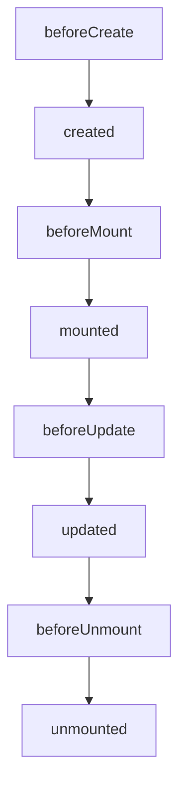

# 学习记录

此项目用来记录我在学习Vue3过程学到的知识点,我认为学习一个新东西最好是通过项目的方式边开发边学这样学习会更有效率,项目可以查看**music**这个目录,一些新特性记录可以查看**demo**

## watch vs watchEffect

> watch

3.x的watch跟2.x写法有些差别, 3.x的watch有两种写法

1. 监听数据可以是一个**getter**

```
const state = reactive({ count: 0 })
watch(
  () => state.count,
  (count, prevCount) => {
    /* ... */
  }
)
```

2. 监听数据可以是一个**ref**

```
const count = ref(0)
watch(count, (count, prevCount) => {
  /* ... */
})
```

> watchEffect

wathcEffect跟watch不同的是,它在初始化时，一定会执行一次, 虽然watch我们可以通过配置**immediate**达到一样的效果, 但它跟watch本质区别在于它初始化的时候就会进行一次依赖收集,我们不需要显示声明需要去监听哪个对象,它就是全自动的,只要你在里面进行声明, 如果你感兴趣watchEffect的实现,可以查看**demo**中我写的实现

```
const state = reactive({
    name: 'badguy',
    age: 20
})
watchEffect(() => {
    console.log('state.name', state.name)
})
```
## Composition API 跟 Options API 的生命周期

#### Options Api



> 相较于vue2, **beforeDestroy**和**destroyed**两个钩子改成了**beforeUnmount**和**unmounted**

#### Composition API

将beforeCreate和created合并成一个**setup**函数,其他钩子前缀+**on**

```
setup() {
  onBeforeMount(() => {}),
  onMounted(() => {}),
  onBeforeUpdate(() => {}),
  onUpdated(() => {}),
  onBeforeUnmount(() => {}),
  onUnmounted(() => {})
}
```

具体相关代码查看demo目录
