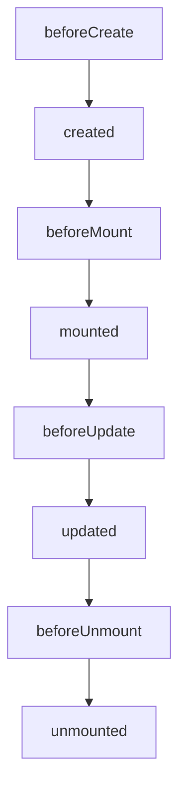

# 学习记录

此项目用来记录我在学习Vue3过程学到的知识点,我认为学习一个新东西最好是通过项目的方式边开发边学这样学习会更有效率,项目可以查看**music**这个目录,一些新特性记录可以查看**demo**

## watch vs watchEffect

> watch

3.x的watch跟2.x写法有些差别, 3.x的watch有两种写法

1. 监听数据可以是一个**getter**

```
const state = reactive({ count: 0 })
watch(
  () => state.count,
  (count, prevCount) => {
    /* ... */
  }
)
```

2. 监听数据可以是一个**ref**

```
const count = ref(0)
watch(count, (count, prevCount) => {
  /* ... */
})
```

> watchEffect

wathcEffect跟watch不同的是,它在初始化时，一定会执行一次, 虽然watch我们可以通过配置**immediate**达到一样的效果, 但它跟watch本质区别在于它初始化的时候就会进行一次依赖收集,我们不需要显示声明需要去监听哪个对象,它就是全自动的,只要你在里面进行声明, 如果你感兴趣watchEffect的实现,可以查看**demo**中我写的实现

```
const state = reactive({
    name: 'badguy',
    age: 20
})
watchEffect(() => {
    console.log('state.name', state.name)
})
```
## Composition API 跟 Options API 的生命周期

#### Options Api



> 相较于vue2, **beforeDestroy**和**destroyed**两个钩子改成了**beforeUnmount**和**unmounted**

#### Composition API

将beforeCreate和created合并成一个**setup**函数,其他钩子前缀+**on**

```
setup() {
  onBeforeMount(() => {}),
  onMounted(() => {}),
  onBeforeUpdate(() => {}),
  onUpdated(() => {}),
  onBeforeUnmount(() => {}),
  onUnmounted(() => {})
}
```

具体相关代码查看demo目录

## ref, toRef和toRefs

- ref用来做什么

1. 生成值类型的响应式数据
2. 可用于模板和reactive
3. reactive对象与对应的ref保持引用关系

```
<span> today is {{weatherRef}} </span>
```
现在有个需求,需要在模板中动态更新当天的天气状态, 因为值类型本身是不具备响应式的, 这时候ref就是它发挥作用的时候

```
setup() {
  const weatherRef = ref('sunny')

  setTimeout(() => {
    weatherRef.value = 'windy'
  }, 1000);

  return {
      weatherRef
  }
}
```

- toRef用来做什么

1. 用于将响应式对象的某个属性封装成一个ref, 且具有响应式
2. 如果是普通对象而非reactive, 则创建的对象[**ObjectRefImpl**]不具备响应式

```
const state = reactive({
  weather: 'sunny',
  mood: 'not bad'
})
const weatherRef = toRef(state, 'weather')

return {
  weatherRef
}
```

- toRefs用来做什么

1. 将响应式对象转为普通对象
2. 生成的普通对象的每一个属性都是一个ref
3. 直接解构reactive对象模板将失去响应式
4. 直接解构toRefs继续保持响应式
5. 在合成函数返回的对象是响应式

toRefs跟toRef近似 但toRefs可以将对象中的所以属性都转化成ref, 写法跟[**toRef**]接近

```
const state = reactive({
  weather: 'sunny',
  mood: 'not bad'
})
const allRef = toRefs(state)

return {
  allRef
}
```

> 完整代码可以查看目录[**demo/ref**]中的源码, 合成函数的例子可以查看[**music**]项目的源码,里面运用了大量的合成函数

#### patchFlag

1. 编译模板时,动态节点做标记
2. 标记分为不同类型, 如TEXT PROPS
3. diff算法时,可以区分静态节点,以及不同类型的动态节点

- 1 /* TEXT */, 动态插入一个文本节点

```code
  <span>Hello World!</span>
```

> 编译后

```code
_createElementVNode("span", null, _toDisplayString(_ctx.msg), 1 /* TEXT */)

```
- 2 /* CLASS */, 动态插入一个class

```code
 <span :class="name"></span>
```
> 编译后

```code
_createElementVNode("span", {
  class: _normalizeClass(_ctx.name)
}, null, 2 /* CLASS */),
```

- 8 /* PROPS */, ["id"], 动态插入一个属性

```code
 <span :id="age"></span>
 <span @click="clickHandler">Hello World!</span>
```

```code
createElementVNode("span", { id: _ctx.age }, null, 8 /* PROPS */, ["id"])

_createElementVNode("span", { onClick: _ctx.clickHandler }, "Hello World!", 8 /* PROPS */, ["onClick"]),

```
当然这些节点都是可以组合的,具体可在这里[测试](https://vue-next-template-explorer.netlify.app)

> 这里解释一下第三点, vue3相对于vue2的diff算法,本质上算法并未发生变化,优化的点是diff的过程,在vue2中通过patchVnode,然后一层一层遍历对比,而在vue3中,我们给节点做了动态和静态的区分,当遇到静态vnode时不会做diff


#### hoistStatic

1. 将静态节点的定义,提升到父作用域,缓存起来
2. 多个相邻的静态节点,会被合并起来
3. 典型的拿空间换时间的优化策略

```code
<div>
  <span>Hello World!</span>
  <span>Hello World!</span>
  <span>{{msg}}</span>
</div>
```

> 经过hoistStatic处理后

```code
const _hoisted_1 = /*#__PURE__*/_createElementVNode("span", null, "Hello World!", -1 /* HOISTED */)
const _hoisted_2 = /*#__PURE__*/_createElementVNode("span", null, "Hello World!", -1 /* HOISTED */)

export function render(_ctx, _cache, $props, $setup, $data, $options) {
  return (_openBlock(), _createElementBlock("div", null, [
    _hoisted_1,
    _hoisted_2,
    _createElementVNode("span", null, _toDisplayString(_ctx.msg), 1 /* TEXT */)
  ]))
}
```

可以看到静态节点做了全局提升

#### cacheHandler

- 用来缓存事件函数

```code
<div>
  <span @click="clickHandler">Hello World!</span>
</div>
```

> 经过缓存之后

```code
export function render(_ctx, _cache, $props, $setup, $data, $options) {
  return (_openBlock(), _createElementBlock("div", null, [
    _createElementVNode("span", {
      onClick: _cache[0] || (_cache[0] = (...args) => (_ctx.clickHandler && _ctx.clickHandler(...args)))
    }, "Hello World!")
  ]))
}
```

#### SSR优化

1. 静态节点直接输出, 跳过dom
2. 动态节点,需要动态渲染

```code
<div>  
  <span>Hello World!</span>
  <span :id="age">{{ msg }}</span>
</div>
```

> 优化后

```code
export function ssrRender(_ctx, _push, _parent, _attrs, $props, $setup, $data, $options) {
  const _cssVars = { style: { color: _ctx.color }}
  _push(`<div${
    _ssrRenderAttrs(_mergeProps(_attrs, _cssVars))
  }><span>Hello World!</span><span${
    _ssrRenderAttr("id", _ctx.age)
  }>${
    _ssrInterpolate(_ctx.msg)
  }</span></div>`)
}
```

#### tree shaking

- 编译时,根据不同写法(如指令),引入不同的API

> 这块就不贴代码了


